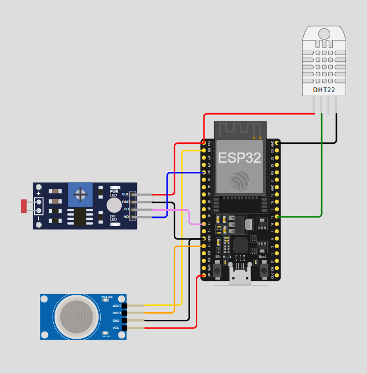

# WatchTower - IoT

**WatchTower** é um sistema global de monitoramento de eventos extremos que **notifica, mapeia e descreve** ocorrências críticas em tempo real. O objetivo principal é **prever riscos** associados a esses eventos, utilizando **Inteligência Artificial** e dados coletados de sensores físicos e digitais, com foco na **proteção da população mundial**.

## 📡 Módulo IoT (ESP32 + Sensores)

Esta parte do projeto representa o **módulo físico de monitoramento**, baseado em **ESP32**, que coleta dados ambientais em diferentes regiões. Ele pode ser personalizado com sensores distintos, dependendo das condições e riscos locais.

### 🎯 Características principais

- Modularidade: sensores podem ser adicionados ou removidos conforme necessário.
- Conectividade Wi-Fi com envio dos dados via WebSocket.
- Comunicação direta com um **gateway baseado em WebSocket**, que centraliza os dados e os repassa para os sistemas superiores.
- Projeto de fácil replicação e adaptação a novos territórios.

> ℹ️ Este projeto utiliza um backend .NET em vez de Node-RED. O fluxo WebSocket é tratado diretamente no código do servidor.


## 🧰 Sensores Suportados

| Sensor       | Função                     |
|--------------|----------------------------|
| DHT22        | Temperatura e Umidade      |
| MQ-2 (Gás)   | Vazamento de Gás           |
| LDR          | Luminosidade (Incêndios, apagões) |

Outros sensores podem ser integrados conforme a necessidade regional (ex: chuvas, sismos, fumaça, barômetros, etc).

## Link do Video

https://youtu.be/Kl_8YtfbcMA

## 📸 Diagrama do Projeto



## ⚙️ Configuração e Execução do Módulo IoT (ESP32)

### 🔧 Pré-requisitos

- Placa: ESP32 (pode simular com Wokwi)

- Bibliotecas necessárias:
    - DHT sensor library
    - WebSocketsClient

- Ambiente de desenvolvimento:
    - Arduino IDE (com suporte à placa ESP32)
    - OU Wokwi (emulador online para ESP32)

## 🧪 Testes e Execução

1. Abra o código no Arduino IDE ou Wokwi

2. Configure os pinos dos sensores conforme necessário (os sensores são opcionais e detectados automaticamente)

3. Altere as configurações de rede Wi-Fi, se necessário:

    ```ino
    const char* ssid = "NOME_DA_REDE";
    const char* password = "SENHA_DA_REDE";
    ```

4. Configure o endereço do servidor WebSocket:

    ```ino
    const char* websocket_server_host = "SEU_BACKEND_IP";
    const uint16_t websocket_server_port = 9090;
    const char* websocket_path = "/ws";
    ```
    > 💡 Caso esteja testando localmente, use o IP local da sua máquina (ex: 192.168.0.100) e certifique-se de que o firewall permite conexões na porta 9090.

## 🔌 Conectividade e Gateway WebSocket

- A comunicação entre o dispositivo IoT (ESP32) e o sistema central ocorre via WebSocket.

- O ESP32 atua como um cliente WebSocket que envia dados de sensores diretamente ao backend.    

    >⚠️ IMPORTANTE: Se o dispositivo mostrar "Desconectado" ou não enviar os dados:
    > - Verifique se o servidor WebSocket está ativo e ouvindo no endereço e porta configurados.
    > - O backend deve aceitar conexões WebSocket em `ws://<IP>:9090/ws`.


## 📤 Envio de Dados

O dispositivo envia um JSON com os dados lidos dos sensores a cada 5 segundos.

Exemplo de mensagem:

    {
        "temperatura": 26.5,
        "umidade": 60.2,
        "gas": 420,
        "luminosidade": 710
    }

Os campos enviados dependem dos sensores conectados. Sensores ausentes serão ignorados automaticamente.
